```mermaid
erDiagram
    publishers {
        serial id PK
        text slug UK "NOT NULL"
        text kind "NOT NULL — 'user' | 'org'"
        integer user_id FK "→ users.id CASCADE (nullable)"
        integer org_id FK "→ organizations.id CASCADE (nullable)"
        timestamp created_at "default now()"
    }

    users {
        serial id PK
        text email UK "NOT NULL"
        text password_hash "NOT NULL"
        boolean is_root_admin "default false"
        text display_name "default ''"
        text publisher_slug UK "default '' (denormalised)"
    }

    organizations {
        serial id PK
        text slug UK "NOT NULL"
        text name "NOT NULL"
        integer creator_id FK "→ users.id SET NULL (nullable)"
        text publisher_slug UK "NOT NULL (denormalised)"
        timestamp created_at "default now()"
    }

    org_memberships {
        serial id PK
        integer org_id FK "NOT NULL → organizations.id CASCADE"
        integer user_id FK "NOT NULL → users.id CASCADE"
        text role "NOT NULL — 'super_admin' | 'admin' | 'member'"
        timestamp joined_at "default now()"
    }

    books {
        serial id PK
        text slug "NOT NULL (unique within owner)"
        text title "NOT NULL"
        text owner_type "NOT NULL — 'user' | 'org'"
        integer owner_id "NOT NULL"
        timestamp created_at "default now()"
        timestamp updated_at "default now()"
    }

    articles {
        serial id PK
        text slug "NOT NULL (unique within owner)"
        text title "NOT NULL"
        text content "raw MDX"
        text summary
        text owner_type "NOT NULL — 'user' | 'org'"
        integer owner_id "NOT NULL"
        boolean is_internal "default false"
        integer parent_book_id FK "→ books.id CASCADE (nullable)"
        jsonb metadata "NOT NULL (ArticleMetadataShape)"
        timestamp created_at "default now()"
        timestamp updated_at "default now()"
    }

    revisions {
        serial id PK
        integer article_id FK "NOT NULL → articles.id CASCADE"
        text content
        text edit_note
        timestamp edited_at "default now()"
    }

    categories {
        serial id PK
        text slug UK "NOT NULL"
        text name "NOT NULL"
        integer parent_id "self-reference (unused in UI)"
    }

    article_categories {
        integer article_id FK "NOT NULL → articles.id CASCADE"
        integer category_id FK "NOT NULL → categories.id CASCADE"
    }

    curriculum_entries {
        serial id PK
        integer book_id FK "NOT NULL → books.id CASCADE"
        integer article_id FK "NOT NULL → articles.id CASCADE"
        integer position "NOT NULL (0-based order)"
        text part_title "optional section heading"
    }

    objects {
        serial id PK
        text slug "NOT NULL (unique within owner)"
        text name "NOT NULL"
        text type "NOT NULL — 'animation' | 'dataset' | 'diagram'"
        jsonb content "NOT NULL (shape varies by type)"
        text description
        text owner_type "NOT NULL — 'user' | 'org'"
        integer owner_id "NOT NULL"
        timestamp created_at "default now()"
        timestamp updated_at "default now()"
    }

    user_themes {
        serial id PK
        integer user_id FK "NOT NULL → users.id CASCADE UNIQUE"
        jsonb light_tokens "NOT NULL (ThemeTokens)"
        jsonb dark_tokens "NOT NULL (ThemeTokens)"
        text color_scheme_preference "default 'system'"
        timestamp updated_at "default now()"
    }

    book_snapshots {
        serial id PK
        integer book_id FK "NOT NULL → books.id CASCADE"
        text note
        timestamp created_at "default now()"
    }

    book_snapshot_entries {
        serial id PK
        integer snapshot_id FK "NOT NULL → book_snapshots.id CASCADE"
        integer article_id FK "NOT NULL → articles.id CASCADE"
        text article_slug "NOT NULL"
        text article_title "NOT NULL"
        text article_content
        integer position "NOT NULL"
        text part_title
    }

    pdf_caches {
        serial id PK
        integer book_id FK "NOT NULL → books.id CASCADE"
        text pdf_data "NOT NULL (base64)"
        text content_hash "NOT NULL (SHA-256)"
        timestamp generated_at "default now()"
    }

    resource_visibility {
        serial id PK
        text resource_type "NOT NULL — 'book' | 'article' | 'object'"
        text owner_type "NOT NULL — 'user' | 'org'"
        integer owner_id "NOT NULL"
        text resource_key "NOT NULL (slug)"
        text visibility "NOT NULL default 'public' — 'public' | 'org' | 'private'"
        timestamp updated_at "default now()"
    }

    access_grants {
        serial id PK
        text resource_type "NOT NULL"
        text owner_type "NOT NULL"
        integer owner_id "NOT NULL"
        text resource_key "NOT NULL (slug)"
        text grantee_type "NOT NULL — 'user' | 'org'"
        integer grantee_id "NOT NULL"
        timestamp granted_at "default now()"
        integer granted_by FK "→ users.id SET NULL (nullable)"
    }

    article_views {
        serial id PK
        integer article_id FK "NOT NULL → articles.id CASCADE"
        timestamp viewed_at "default now() NOT NULL"
    }

    users ||--o| publishers : "has publisher"
    organizations ||--o| publishers : "has publisher"
    organizations ||--o{ org_memberships : "has members"
    users ||--o{ org_memberships : "belongs to"
    users ||--o| user_themes : "has theme"
    books ||--o{ curriculum_entries : "contains"
    articles ||--o{ curriculum_entries : "appears in"
    articles ||--o{ revisions : "has revisions"
    articles ||--o{ article_categories : "tagged with"
    categories ||--o{ article_categories : "tags"
    book_snapshots ||--o{ book_snapshot_entries : "contains"
    articles ||--o{ book_snapshot_entries : "captured in"
    articles ||--o{ article_views : "viewed via"
```

# Database Schema

Principia Synthesia uses PostgreSQL via Drizzle ORM. The schema is defined in
`db/schema.ts`. Below is the entity-relationship diagram.

---

---

## Key design decisions

### Publisher namespace

A `publishers` row is the global slug registry for all content. Both users and
organizations have a publisher slug that appears in URL paths
(`/:publisher/articles/[slug]`, `/:publisher/books/[bookSlug]`, etc.). Exactly
one of `userId` or `orgId` is non-null on each row (enforced by a database
CHECK constraint). The `publisherSlug` column on both `users` and `organizations`
is a denormalized copy to avoid a join in the hot path; the canonical slug lives
in `publishers`.

### Books are an explicit table

A `books` row represents a curriculum collection. Slugs are unique within a
publisher (`ownerType`, `ownerId`, `slug` triple). The old design used an
implicit book model (shared `bookSlug` text on `curriculumEntries`); the current
schema uses a proper FK (`curriculumEntries.bookId → books.id`).

### Articles are publisher-scoped

`articles.slug` is unique within a publisher (enforced by a composite unique
index on `ownerType`, `ownerId`, `slug`), not globally unique. The same slug
can exist for two different publishers.

### Internal articles

`articles.isInternal = true` marks articles that belong exclusively to one book.
`articles.parentBookId` (FK → `books.id`) records which book owns them. Internal
articles are not accessible via the standalone article route; they cascade-delete
when their parent book is deleted.

### Three-state visibility

`resourceVisibility.visibility` is `'public' | 'org' | 'private'` (not a
boolean). `'org'` means viewable by any member of the owning organization
without a specific grant. `'private'` requires an explicit `accessGrants` row.
Absent row defaults to `'public'`.

### Org membership roles

`orgMemberships.role` is `'super_admin' | 'admin' | 'member'` (three values).
The plan-era schema had only `'owner' | 'member'`.

### Objects table (no plugin columns)

The `objects` table has no `source` or `pluginMeta` columns. The animation
plugin registry was removed; all animations are user-created objects. `slug` is
unique within a publisher via a composite unique index.

### `color_scheme_preference` column

Added to `user_themes` to support the no-flash dark-mode implementation.
Values: `'system'` (default, follows OS), `'light'`, `'dark'`.

### Book snapshots

`bookSnapshots` and `bookSnapshotEntries` enable point-in-time captures of a
book's structure. `bookId` is now a FK to `books.id` (replacing the old
`bookSlug`/`bookTitle` text columns). Both tables cascade-delete when their
parent book is deleted.

### PDF cache

`pdfCaches` stores generated PDF exports. `bookId` is a FK to `books.id`
(replacing the old `bookSlug` text column). The `contentHash` is a SHA-256
digest of the book title plus all entry positions, part titles, article titles,
and article content. At most one cached PDF per book — old entries are replaced
on cache miss.

### Article views

`articleViews` stores one row per article page render for view-count
aggregation (e.g. homepage top-5 by 30-day views). No PII is stored. Indexed
on `(articleId, viewedAt)` for the monthly aggregation query.
