```mermaid
erDiagram
    users {
        serial id PK
        text email UK "NOT NULL"
        text password_hash "NOT NULL"
        boolean is_admin "default false"
    }

    articles {
        serial id PK
        text slug UK "NOT NULL"
        text title "NOT NULL"
        text content
        text summary
        timestamp created_at "default now()"
        timestamp updated_at "default now()"
    }

    revisions {
        serial id PK
        integer article_id FK "NOT NULL → articles.id CASCADE"
        text content
        text edit_note
        timestamp edited_at "default now()"
    }

    categories {
        serial id PK
        text slug UK "NOT NULL"
        text name "NOT NULL"
        integer parent_id "self-reference (unused in UI)"
    }

    article_categories {
        integer article_id FK "NOT NULL → articles.id CASCADE"
        integer category_id FK "NOT NULL → categories.id CASCADE"
    }

    curriculum_entries {
        serial id PK
        text book_slug "NOT NULL"
        text book_title "NOT NULL"
        integer article_id FK "NOT NULL → articles.id CASCADE"
        integer position "NOT NULL (0-based order)"
        text part_title "optional section heading"
    }

    saved_animations {
        serial id PK
        text slug UK "NOT NULL"
        text name "NOT NULL"
        text code "NOT NULL (raw JS)"
        timestamp created_at "default now()"
    }

    user_themes {
        serial id PK
        integer user_id FK "NOT NULL → users.id CASCADE UNIQUE"
        jsonb light_tokens "NOT NULL (ThemeTokens)"
        jsonb dark_tokens "NOT NULL (ThemeTokens)"
        text color_scheme_preference "default 'system'"
        timestamp updated_at "default now()"
    }

    book_snapshots {
        serial id PK
        text book_slug "NOT NULL"
        text book_title "NOT NULL"
        text note
        timestamp created_at "default now()"
    }

    book_snapshot_entries {
        serial id PK
        integer snapshot_id FK "NOT NULL → book_snapshots.id CASCADE"
        integer article_id FK "NOT NULL → articles.id CASCADE"
        text article_slug "NOT NULL"
        text article_title "NOT NULL"
        text article_content
        integer position "NOT NULL"
        text part_title
    }

    pdf_caches {
        serial id PK
        text book_slug "NOT NULL"
        text pdf_data "NOT NULL (base64)"
        text content_hash "NOT NULL (SHA-256)"
        timestamp generated_at "default now()"
    }

    users ||--o| user_themes : "has theme"
    articles ||--o{ revisions : "has revisions"
    articles ||--o{ article_categories : "tagged with"
    categories ||--o{ article_categories : "tags"
    articles ||--o{ curriculum_entries : "appears in"
    book_snapshots ||--o{ book_snapshot_entries : "contains"
    articles ||--o{ book_snapshot_entries : "captured in"
```

# Database Schema

Principia Synthesia uses PostgreSQL via Drizzle ORM. The schema is defined in
`db/schema.ts`. Below is the entity-relationship diagram.

---

---

## Key design decisions

### Books have no dedicated table
A "book" is implicitly defined by a shared `book_slug` value across multiple
`curriculum_entries` rows. Deleting all entries for a `book_slug` deletes the
book. The `book_title` is denormalized onto every entry.

### Unique constraint on `(book_slug, article_id)`
An article can appear in a given book at most once. It may appear in multiple
different books.

### `color_scheme_preference` column
Added to `user_themes` to support the no-flash dark-mode implementation (task 5.5).
Values: `'system'` (default, follows OS), `'light'`, `'dark'`.

### Book snapshots
`book_snapshots` and `book_snapshot_entries` enable point-in-time captures of
a book's structure (added in task 4.3). `article_content` is stored in the
snapshot entry so content can optionally be rolled back. Both tables cascade-
delete when their parent is removed.

### PDF cache
`pdf_caches` stores generated PDF exports keyed by `book_slug`. The
`content_hash` is a SHA-256 digest of the book title plus all entry positions,
part titles, article titles, and article content. On each PDF request the hash
is recomputed — a match returns the cached PDF without launching Chromium. Old
entries for the same `book_slug` are replaced on cache miss, so there is at
most one row per book at any time.
